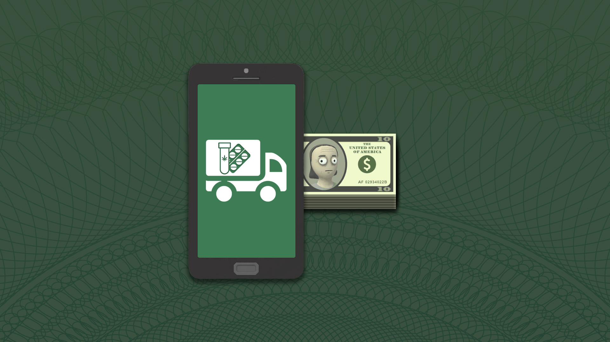

# 💸 Schedule I: [Illegal] Delivery With Cash Mod

This mod fixes a gameplay inconsistency in the game **Schedule I** where illegal shops accessed via the in-game delivery app would incorrectly charge your **bank account** instead of requiring **cash**, as they do in person.

With this mod, **all illegal transactions** now correctly **require cash only**, regardless of whether you're shopping in person or via the delivery app.

## 📋 Requirements

- 🍉 [MelonLoader](https://github.com/LavaGang/MelonLoader)

## 🔧 Installation

1. Make sure you have properly installed and setup MelonLoader.
2. Download the latest version from the [Releases](https://github.com/unpatch/DeliveryWithCash/releases) page.
3. Drop the mod file `DeliveryWithCash.dll` into your `Schedule I` mods directory.

## 🧪 Tested On

- Game: `v0.3.6f6`
- Melon Loader: `v0.7.1`

## 🗨️ Why This Mod?

In the base game, illegal items are meant to be bought with **untraceable cash**, maintaining realism and gameplay balance. However, a loophole allowed players to use **bank accounts** through the delivery app to buy illegal goods. This mod closes that loophole and restores consistency.
